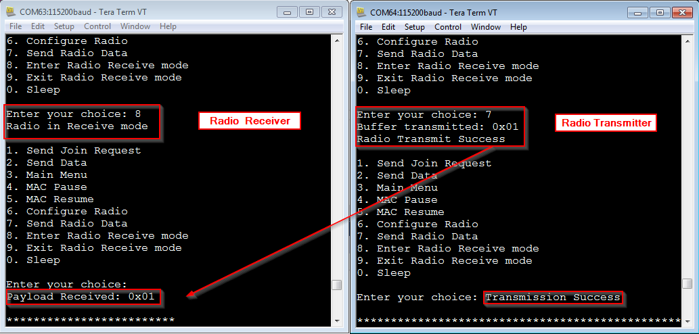

# ATSAMR34_LORAWAN_LORA_MODULATION


> “Wireless Made Easy!" - Adding LoRa Peer-to-Peer Connection to an existing LoRaWAN Application

<p>
<a href="https://www.microchip.com" target="_blank">

</a>
</p>

## ⚠ Disclaimer

<p><span style="color:red"><b>
Subject to your compliance with these terms, you may use Microchip software and any derivatives exclusively with Microchip products. It is your responsibility to comply with third party license terms applicable to your use of third party software (including open source software) that may accompany Microchip software.<br>
THIS SOFTWARE IS SUPPLIED BY MICROCHIP "AS IS". NO WARRANTIES, WHETHER EXPRESS, IMPLIED OR STATUTORY, APPLY TO THIS SOFTWARE, INCLUDING ANY IMPLIED WARRANTIES OF NON-INFRINGEMENT, MERCHANTABILITY, AND FITNESS FOR A PARTICULAR PURPOSE.<br>
IN NO EVENT WILL MICROCHIP BE LIABLE FOR ANY INDIRECT, SPECIAL, PUNITIVE, INCIDENTAL OR CONSEQUENTIAL LOSS, DAMAGE, COST OR EXPENSE OF ANY KIND WHATSOEVER RELATED TO THE SOFTWARE, HOWEVER CAUSED, EVEN IF MICROCHIP HAS BEEN ADVISED OF THE POSSIBILITY OR THE DAMAGES ARE FORESEEABLE. TO THE FULLEST EXTENT ALLOWED BY LAW, MICROCHIP'S TOTAL LIABILITY ON ALL CLAIMS IN ANY WAY RELATED TO THIS SOFTWARE WILL NOT EXCEED THE AMOUNT OF FEES, IF ANY, THAT YOU HAVE PAID DIRECTLY TO MICROCHIP FOR THIS SOFTWARE.
</span></p></b>

> Interact with your peers about this software in [LoRa Forum](https://www.microchip.com/forums/f512.aspx).

## Abstract

**Based on LoRaWAN Mote Application generated from ASFv3, this sample code demonstrates the coexistence of a LoRaWAN Application and a pure radio communication between 2x ATSAMR34 Xplained Pro boards using LoRa modulation.**

For more information on Microchip ATSAMR34 LoRa SiP devices, visit Microchip webpage: </br>
https://www.microchip.com/design-centers/wireless-connectivity/low-power-wide-area-networks/lora-technology/sam-r34-r35


## Get a Microchip ATSAMR34 Xplained Pro evaluation kit

The ATSAMR34 Xplained Pro evaluation kit is a hardware platform used to evaluate the ATSAMR34 Low Power LoRa® Sub-GHz SiP. It is supported by Microchip Studio 7.0 IDE and a collection of sample codes are available from Advanced Software Framework (ASFv3) since the 3.44.0 release.
The Xplained Pro MCU series evaluation kit includes an on-board Embedded Debugger (EDBG), and no external tools are necessary to program or debug the ATSAMR34.
The kit offers a set of features that enable the user to get started with the ATSAMR34 Low Power LoRa® Sub-GHz SiP peripherals right away, and to understand how to integrate the device in your own design.
The ATSAMR34 Xplained Pro kit contains the following items:
- One ATSAMR34 Xplained Pro </br>
- One external antenna </br>


## Software

- Download and install [Microchip Studio 7.0 IDE](https://www.microchip.com/mplab/microchip-studio)
- Open Microchip Studio 7.0 IDE.
- From **Tools - > Extensions and updates**, install Advanced Software Framework (ASFv3) v3.44.0 release or upper release.
- Restart Microchip Studio
- Download and install a serial terminal program like Tera Term. </br>
https://osdn.net/projects/ttssh2/releases/

## Hardware Setup

To demonstrate peer-to-peer communication, you do need at least 2x ATSAMR34 Xplained Pro boards.

- In order to connect in LoRaWAN, you will need to be in range of your gateway. If you don’t have gateway, check the world map (https://www.thethingsnetwork.org/map) to see if your local community has gateway deployed around your location.
- Plug the antennas and always make sure you have the antennas plugged to your boards before powering it up. </br>
- Connect the boards to the PC through the micro-USB cables. </br>
USB cables must be connected to the EDBG USB connectors of the ATSAMR34 kits.
- Wait for USB driver installation and COM ports mounting. The USB ports powers the board and enables the user to communicate with the kits. </br>
- Launch Tera Term program and configure the serial ports mounted with: 115200 bps, 8/N/1 </br>

## LoRaWAN Mote Application + Peer-to-peer

This project integrates the Microchip LoRaWAN Stack (MLS) Software API which provide an interface to the different software modules. </br></br>
For this application, we will “Pause” the LoRaWAN MAC Layer (MAC) and use the LoRaWAN Radio Layer (TAL) for peer-to-peer communication and “Resume” the LoRaWAN MAC Layer to perform the LoRaWAN operations. </br></br>
**In peer-to-peer configuration, the LoRaWAN MAC layer is bypassed and let the ability to drive the radio directly with no protocol, no security, no unique identifier for a device and obviously no interoperability and ecosystem (in opposite with LoRaWAN). This can serve to demonstrate the ability to use P2P communication in a LoRaWAN application.** </br></br>
<span style="color:red">**Please ensure to not violate the local regulations for the corresponding frequency bands. E.g. 25mW and 1% duty cycle for the 868MHz-band inside Europe.**</span></br></br>

 </br>

The MAC Layer provides the functionality of operations defined in the LoRaWAN Specification.</br>
The TAL layer uses the radio drivers and provides access to the SX1276 transceiver.</br></br>
To be able to setup the devices for a point to point connection, the code needs to:</br>
- Initialize the LoRaWAN MAC stack and radio software layers.
``` 
void LORAWAN_Init(AppDataCb_t appdata, JoinResponseCb_t joindata);
```
- Reset the LoRaWAN stack software and initializes the stack with the parameters for the selected ISM band.
```
StackRetStatus_t LORAWAN_Reset (IsmBand_t ismBand);
```
- Pause the LoRaWAN stack functionality to allow radio transceiver configuration and functionality to be performed.
```
uint32_t LORAWAN_Pause (void);
```
- Set the parameters of LoRa radio (frequency, spreading factor, bandwidth, tx output power, …).
```
RadioError_t RADIO_SetAttr(RadioAttribute_t attribute, void *value);
```
- Make use of the Watchdog Timer to update the time-out length (in milliseconds) applied to the radio Watchdog Timer.
```
RADIO_SetAttr(WATCHDOG_TIMEOUT,(void *)&wdt) ;
```
</br>
Throughput and range depend on 3 main LoRa parameters: BW, CR and SF. </br>
BW is the physical bandwidth for RF modulation (e.g. 125kHz). Larger signal bandwidth allows for higher effective data rate, thus reducing transmission time at the expense of reduced sensitivity. </br>
CR, the coding rate for forward error detection and correction. Such coding incurs a transmission overhead and the lower the coding rate, the higher the coding rate overhead ratio, e.g. with coding rate=4/(4+CR) the overhead ratio is 1.25 for CR=1 which is the minimum value. </br>
Finally, the spreading factor (SF), which can be set from 7 to 12. The lower the SF, the higher the data rate transmission but the lower the immunity to interference thus the smaller is the range.
</br></br>
To transmit or receive packet from one device to the other, the following functions are required:

	RadioError_t RADIO_Receive(RadioReceiveParam_t *param);

This function set the device in receive mode to receive data and store it in the buffer pointer space by doing a task post to the RADIO_RxHandler.

	RadioError_t RADIO_Transmit(RadioTransmitParam_t *param);

This function transmits the data by doing a task post to the RADIO_TxHandler.

___

For peer-to-peer communication, the sample code configures the radio with the following parameters:</br>

- Bandwidth = BW_125KHZ
- Channel frequency = FREQ_868100KHZ
- Channel frequency deviation = 25000
- CRC = enabled
- Error Coding Rate = 4/5
- IQ Inverted = disabled
- LoRa Sync Word = 0x34
- Modulation = LoRa
- PA Boost = disabled (disabled for EU , enabled for NA)
- Output Power = 1 (up to +14dBm for EU / up to +20dBm for NA)
- Spreading Factor = SF7
- Watchdog timeout = 60000

## Scheduler

- Start Microchip Studio 7 IDE
- Open this project
- The LoRaWAN Mote Application is using a priority based scheduler to handle the application tasks. 
- Open src/enddevice_demo.h to observe the definition of the tasks IDs and tasks State.
```
typedef enum _AppTaskIds_t
{
	DISPLAY_TASK_HANDLER,
	PROCESS_TASK_HANDLER,
	APP_TASKS_COUNT
}AppTaskIds_t;

typedef enum _AppTaskState_t
{
	RESTORE_BAND_STATE,
	DEMO_CERT_APP_STATE,
	DEMO_APP_STATE,
	JOIN_SEND_STATE
}AppTaskState_t;
```

- Open src/enddevice_demo.c to observe how to define the application tasks priorities. Each tasks has different priority.
The scheduler takes the hightest priority task, execute it, return to the main function and handle the next one.
The SYSTEM_RunTasks() API is running in the main function loop and acting as the tasks execution entry point.

```
static SYSTEM_TaskStatus_t (*appTaskHandlers[APP_TASKS_COUNT])(void) = {
    /* In the order of descending priority */
    displayTask,
    processTask
};
```

- To process a task, the state variable has to be filled and corresponding handler of the task has to be posted.
```
	appTaskState = JOIN_SEND_STATE;
	appPostTask(DISPLAY_TASK_HANDLER);
```

- Displaying the menu for joining to a network and sending data to a network is one of the function called by the displayTask() when a DISPLAY_TASK_HANDLER has been posted in the tasks queue.
``` 
/*********************************************************************//**
\brief    Calls appropriate functions based on state variables
*************************************************************************/
static SYSTEM_TaskStatus_t displayTask(void)
{
	switch(appTaskState)
	{
		case RESTORE_BAND_STATE:
			displayRunRestoreBand();
			break;
		case DEMO_CERT_APP_STATE:
			displayRunDemoCertApp();
			break;
		case DEMO_APP_STATE:
			displayRunDemoApp();
			break;
		case JOIN_SEND_STATE:
			displayJoinAndSend();
			break;
		default:
			printf("Error STATE Entered\r\n");
			break;
	}
	
	return SYSTEM_TASK_SUCCESS;
}
```

- You can observe the elements of the menu related to peer-to-peer communication:

```
/*********************************************************************//**
\brief    Displays and activates LED's for joining to a network
		  and sending data to a network
*************************************************************************/
static void displayJoinAndSend(void)
{
    printf("\r\n1. Send Join Request\r\n");
    printf("2. Send Data\r\n");

	// new menu with p2p
	printf("3. Main Menu\r\n") ;
	printf("4. MAC Pause\r\n") ;
	printf("5. MAC Resume\r\n") ;
	printf("6. Configure Radio\r\n") ;
	printf("7. Send Radio Data\r\n") ;
	printf("8. Enter Radio Receive mode\r\n") ;
	printf("9. Exit Radio Receive mode\r\n") ;
#ifdef CONF_PMM_ENABLE
	printf("0. Sleep\r\n") ;
#endif
	printf("\r\nEnter your choice: ");
    set_LED_data(LED_AMBER,&off);
    set_LED_data(LED_GREEN,&off);	
	startReceiving = true;
}
```

- In this particular menu, when a user is typing a character in the serial console, the PROCESS_TASK_HANDLER is posted to process the input value.
```
/*********************************************************************//**
\brief    Pulls the data from UART when activated
*************************************************************************/
void serial_data_handler(void)
{
	int rxChar;
	char serialData;
	/* verify if there was any character received*/
	if (startReceiving == true)
	{
		if((-1) != (rxChar = sio2host_getchar_nowait()))
		{
			serialData = (char)rxChar;
			if((serialData != '\r') && (serialData != '\n') && (serialData != '\b'))
			{
				startReceiving = false;
  			    serialBuffer = rxChar;
			    appPostTask(PROCESS_TASK_HANDLER);
				printf("\r\n");			
			}
		}
	}
}
```

- And the processTask handler is called to execute the appropriate function based on state variable.
```
/*********************************************************************//**
\brief    Calls appropriate functions based on state variables
*************************************************************************/
static SYSTEM_TaskStatus_t processTask(void)
{
	switch(appTaskState)
	{
		case RESTORE_BAND_STATE:
			processRunRestoreBand();
			break;
		case DEMO_CERT_APP_STATE:
			processRunDemoCertApp();
			break;
		case DEMO_APP_STATE:
			processRunDemoApp();
			break;
		case JOIN_SEND_STATE:
			processJoinAndSend();
			break;
		default:
			printf("Error STATE Entered\r\n");
			break;
	}
	
	return SYSTEM_TASK_SUCCESS;
}
```

- If a key input has been pressed in the "JoinAndSend" menu, the following function is executed:
```
/*********************************************************************//**
\brief    Sends Join request or Data to the network
*************************************************************************/
static void processJoinAndSend(void)
{
	StackRetStatus_t status = LORAWAN_SUCCESS;
	if(serialBuffer == '1')
	{
		status = LORAWAN_Join(DEMO_APP_ACTIVATION_TYPE);
		if (LORAWAN_SUCCESS == (StackRetStatus_t)status)
		{
			set_LED_data(LED_GREEN,&on);
			printf("\nJoin Request Sent\n\r");

		}
		else
		{
			set_LED_data(LED_AMBER,&on);
			print_stack_status(status);
			appTaskState = JOIN_SEND_STATE;
			appPostTask(DISPLAY_TASK_HANDLER);
		}
	}
	else if(serialBuffer == '2' && joined == true)
	{
		sendData();
	}
	else if(serialBuffer == '2' && !joined)
	{
		set_LED_data(LED_AMBER,&on);
		printf("Device not joined to the network\r\n");
		appTaskState = JOIN_SEND_STATE;
		appPostTask(DISPLAY_TASK_HANDLER);
	}
#ifdef CONF_PMM_ENABLE
	else if(serialBuffer == '0')
	{
		static bool deviceResetsForWakeup = false;
		PMM_SleepReq_t sleepReq;
		/* Put the application to sleep */
		sleepReq.sleepTimeMs = DEMO_CONF_DEFAULT_APP_SLEEP_TIME_MS;
		sleepReq.pmmWakeupCallback = appWakeup;
		sleepReq.sleep_mode = CONF_PMM_SLEEPMODE_WHEN_IDLE;
		if (CONF_PMM_SLEEPMODE_WHEN_IDLE == SLEEP_MODE_STANDBY)
		{
			deviceResetsForWakeup = false;
		}
		if (true == LORAWAN_ReadyToSleep(deviceResetsForWakeup))
		{
			app_resources_uninit();
			if (PMM_SLEEP_REQ_DENIED == PMM_Sleep(&sleepReq))
			{
				HAL_Radio_resources_init();
				sio2host_init();
				appTaskState = JOIN_SEND_STATE;
				appPostTask(DISPLAY_TASK_HANDLER);
				printf("\r\nsleep_not_ok\r\n");	
			}
		}
		else
		{
			printf("\r\nsleep_not_ok\r\n");
			appTaskState = JOIN_SEND_STATE;
			appPostTask(DISPLAY_TASK_HANDLER);
		}
	}
#endif
	else if (serialBuffer == '3')
	{
		// main menu
		appTaskState = DEMO_APP_STATE;
		appPostTask(DISPLAY_TASK_HANDLER);
	}
	else if (serialBuffer == '4')
	{
		// Pause the Microchip LoRaWAN Stack
		uint32_t time_ms ;
		time_ms = LORAWAN_Pause() ;
		printf("\r\nMAC Pause %ld\r\n", time_ms) ;
		appTaskState = JOIN_SEND_STATE ;
		appPostTask(DISPLAY_TASK_HANDLER) ;
	}
	else if (serialBuffer == '5')
	{
		// Resume the Microchip LoRaWAN Stack
		LORAWAN_Resume() ;
		printf("\r\nMAC Resume\r\n") ;
		appTaskState = JOIN_SEND_STATE ;
		appPostTask(DISPLAY_TASK_HANDLER) ;
	}
	else if (serialBuffer == '6')
	{
		// Configure Radio Parameters
		// --------------------------
		// Bandwidth = BW_125KHZ
		// Channel frequency = FREQ_868100KHZ
		// Channel frequency deviation = 25000
		// CRC = enabled
		// Error Coding Rate = 4/5
		// IQ Inverted = disabled
		// LoRa Sync Word = 0x34
		// Modulation = LoRa
		// PA Boost = disabled (disabled for EU , enabled for NA)
		// Output Power = 1 (up to +14dBm for EU / up to +20dBm for NA)
		// Spreading Factor = SF7
		// Watchdog timeout = 60000

		// Bandwidth
		RadioLoRaBandWidth_t bw = BW_125KHZ ;
		RADIO_SetAttr(BANDWIDTH, &bw) ;
		printf("Configuring Radio Bandwidth: 125kHz\r\n") ;
		// Channel Frequency
		uint32_t freq = FREQ_868100KHZ ;
		RADIO_SetAttr(CHANNEL_FREQUENCY, &freq) ;
		printf("Configuring Channel Frequency %ld\r\n", freq) ;
		// Channel Frequency Deviation
		uint32_t fdev = 25000 ;
		RADIO_SetAttr(CHANNEL_FREQUENCY_DEVIATION, &fdev) ;
		printf("Configuring Channel Frequency Deviation %ld\r\n", fdev) ;
		// CRC
		uint8_t crc_state = 1 ;
		RADIO_SetAttr(CRC, &crc_state) ;
		printf("Configuring CRC state: %d\r\n", crc_state) ;
		// Error Coding Rate
		RadioErrorCodingRate_t cr = CR_4_5 ;
		RADIO_SetAttr(ERROR_CODING_RATE, &cr) ;
		printf("Configuring Error Coding Rate 4/5\r\n") ;
		// IQ Inverted
		uint8_t iqi = 0 ;
		RADIO_SetAttr(IQINVERTED, &iqi) ;
		printf("Configuring IQ Inverted: %d\r\n", iqi) ;
		// LoRa Sync Word
		uint8_t sync_word = 0x34 ;
		RADIO_SetAttr(LORA_SYNC_WORD, &sync_word) ;
		printf("Configuring LoRa sync word 0x%x\r\n", sync_word) ;
		// Modulation
		RadioModulation_t mod = MODULATION_LORA ;
		RADIO_SetAttr(MODULATION, &mod) ;
		printf("Configuring Modulation: LORA\r\n") ;
		// PA Boost
		uint8_t pa_boost = 0 ;
		RADIO_SetAttr(PABOOST, &pa_boost) ;
		printf("Configuring PA Boost: %d\r\n", pa_boost) ;
		// Tx Output Power
		int16_t outputPwr = 1 ;
		RADIO_SetAttr(OUTPUT_POWER, (void *)&outputPwr) ;
		printf("Configuring Radio Output Power %d\r\n", outputPwr) ;
		// Spreading Factor
		int16_t sf = SF_7 ;
		RADIO_SetAttr(SPREADING_FACTOR, (void *)&sf) ;
		printf("Configuring Radio SF %d\r\n", sf) ;
		// Watchdog Timeout
		uint32_t wdt = 60000 ;
		RADIO_SetAttr(WATCHDOG_TIMEOUT, (void *)&wdt) ;
		printf("Configuring Radio Watch Dog Timeout %ld\r\n", wdt) ;
		appTaskState = JOIN_SEND_STATE ;
		appPostTask(DISPLAY_TASK_HANDLER) ;		
	}
	else if (serialBuffer == '7')
	{
		// Radio Transmit
		// the counter value
		counter++ ;
		if (counter > 255) counter = 0 ;
		tx_buffer[0] = counter ;
		printf("Buffer transmitted: ") ;
		print_array(tx_buffer, 1) ;
		RadioError_t radioStatus ;
		RadioTransmitParam_t radioTransmitParam ;
		radioTransmitParam.bufferLen = 1 ;
		radioTransmitParam.bufferPtr = (uint8_t *)&tx_buffer ;
		radioStatus = RADIO_Transmit(&radioTransmitParam) ;
		switch (radioStatus)
		{
			case ERR_NONE:
			{
				printf("Radio Transmit Success\r\n") ;
			}
			break ;
			case ERR_DATA_SIZE:
			{
				// do nothing, status already set to invalid
			}
			break ;
			default:
			{
				printf("Radio Busy\r\n") ;
			}
		}
		appTaskState = JOIN_SEND_STATE ;
		appPostTask(DISPLAY_TASK_HANDLER) ;
	}
	else if (serialBuffer == '8')
	{
		// Enter Radio Receive mode
		RadioReceiveParam_t radioReceiveParam ;
		uint32_t rxTimeout = 0 ;	// forever
		radioReceiveParam.action = RECEIVE_START ;
		radioReceiveParam.rxWindowSize = rxTimeout ;
		if (RADIO_Receive(&radioReceiveParam) == 0)
		{
			printf("Radio in Receive mode\r\n") ;
		}
		appTaskState = JOIN_SEND_STATE ;
		appPostTask(DISPLAY_TASK_HANDLER) ;
	}
	else if (serialBuffer == '9')
	{
		// Stop Radio Receive mode
		RadioReceiveParam_t radioReceiveParam ;
		radioReceiveParam.action = RECEIVE_STOP ;
		if (RADIO_Receive(&radioReceiveParam) == 0)
		{
			printf("Radio Exit Receive mode\r\n") ;
		}
		appTaskState = JOIN_SEND_STATE ;
		appPostTask(DISPLAY_TASK_HANDLER) ;
	}
	else
	{
		set_LED_data(LED_AMBER,&on);
		printf("Invalid choice entered\r\n");
		appTaskState = JOIN_SEND_STATE;
		appPostTask(DISPLAY_TASK_HANDLER);
	}
}
```

- You can observe in the above function, the sub-routines related to peer-to-peer communication for key inputs between 6 and 9.
<br>

## Provisioning the LoRaWAN activation parameters

- Start Microchip Studio 7 IDE
- Open this project
- To activate your ATSAMR34 Xplained Pro board on a LoRa Network Server, you will be using the OTAA activation procedure. The OTAA method requires the following parameters to be embedded into the LoRaWAN Mote Application:
  </br>- AppEUI : Copy/Paste from your Network Server
  </br>- AppKey: Copy/Paste from your Network Server
  </br>- DevEUI: Serialized (Embedded) in the EDBG chip of the ATMSAMR34 Xplained Pro evaluation kit
</br></br></br>
The LoRaWAN Mote Application provides configurable parameters such as OTAA credentials in conf_app.h file. This file is available at <your project folder>/src/config.
- To provision your device, perform the following steps.
- From the "Solution Explorer" pane, expand the /src/config folders.
- Open the conf_app.h file.
The file contains the possible configuration related to the LoRaWAN Mote Application.
- Modify the values of the DEMO_APPLICATION_EUI and DEMO_APPLICATION_KEY macros with the AppEUI and AppKey you've collected from your Network Server.
```
	/* OTAA Join Parameters */
	#define DEMO_DEVICE_EUI                         {0xde, 0xaf, 0xfa, 0xce, 0xde, 0xaf, 0xfa, 0xce}
	#define DEMO_APPLICATION_EUI                    {0x00, 0x00, 0x00, 0x00, 0x00, 0x00, 0x00, 0x05}
	#define DEMO_APPLICATION_KEY                    {0x00, 0x00, 0x00, 0x00, 0x00, 0x00, 0x00, 0x00, 0x00, 0x00, 0x00, 0x00, 0x00, 0x00, 0x00, 0x05}
```
- By default, the LoRaWAN Mote Application uses the embedded DevEUI from the EDBG chip. You can use your own DevEUI by changing the value of the EDBG_EUI_READ macro located in the symbols definition and in conf_board.h file. Make sure the DevEUI is the same on both side: end-device and network server.

conf_board.h file:

	/* TODO: If Board is having EDBG with DEV_EUI flashed in
	Userpage Enable this Macro otherwise make it as 0 */
	#define EDBG_EUI_READ      1

## Tutorial

- Start Microchip Studio 7 IDE
- Open this project
- From the Microchip Studio menu, go to: Build -> Build Solution
- Flash the firmware on the two ATSAMR34 Xplained Pro boards
- Open two Tera Term sessions with 115200 bps 8N1 configuration.
- Reset the two boards
- On both sides, the application will start and on Tera Term the menu is displayed.</br>
- From here, you can interact with the application </br>
- From the first menu, select the Demo application.
</br></br> </br></br>
- From the second menu and according to your regional band configuration, select the appropriate band.
</br></br> </br></br>
- Then, the end-device will automatically try to join the network using the OTAA parameters you have modified previously in the code. You should observe a successful join message otherwise double check the OTAA keys on both side (end-device and Network Server) and send a Join Request from the menu.
- The third menu gives you the available options to perform LoRaWAN or peer-to-peer operations based on pure radio transaction.
</br></br> </br></br>
- LoRaWAN MAC Layer domain operations:
  </br>1. Send Join Request -> activate your device within a LoRaWAN Network
  </br>2. Send Data -> transmit the temperature data to a LoRaWAN Network
  </br>3. Main Menu -> go back to the main menu to select the regional band
  </br>4. MAC Pause -> pause the execution of the LoRaWAN MAC
  </br>5. MAC Resume -> resume the execution of the LoRaWAN MAC
- Radio TAL Layer domain operations:
  </br>6. Configure Radio -> configure the radio according to the different attributes
  </br>7. Send Radio Data -> transmit a radio packet over the air
  </br>8. Enter Radio Receive mode -> put the device in receiver mode
  </br>9. Exit Radio Receive mode -> exit from the receiver mode
</br></br>
- From the third menu displayed, select "Send Data" if your device has correctly joined a LoRaWAN Network
</br></br> </br></br>
- The end-device will transmit uplink message which contains the temperature in Celsius and in Fahrenheit formats.
- You can observe your board's uplink payload data by connecting to the dashboard of your Network Server.
- Now, let's switch the two devices from LoRaWAN operation to a pure radio communication between a transmitter and a receiver.
</br></br> </br></br>
- On the receiver side, perform the following steps from the menu:
  </br>1. MAC Pause
  </br>2. Configure Radio
  </br>3. Enter Radio Receive mode
- On the transmitter side, perform the following steps from the menu:
  </br>4. MAC Pause
  </br>5. Configure Radio
  </br>6. Send Radio Data
</br></br>
- You can observe the radio transaction. A counter value is incremented and transmitted from one device to the other.
</br></br> </br></br>
- A reception timeout event or a packet received results to automatically exit from reception mode
- In the same way, it is possible to exchange the roles and perform a two-way conversation
</br></br> </br></br>
- To go back to LoRaWAN operations, just resume the MAC and transmit uplink data
</br></br> </br></br>
